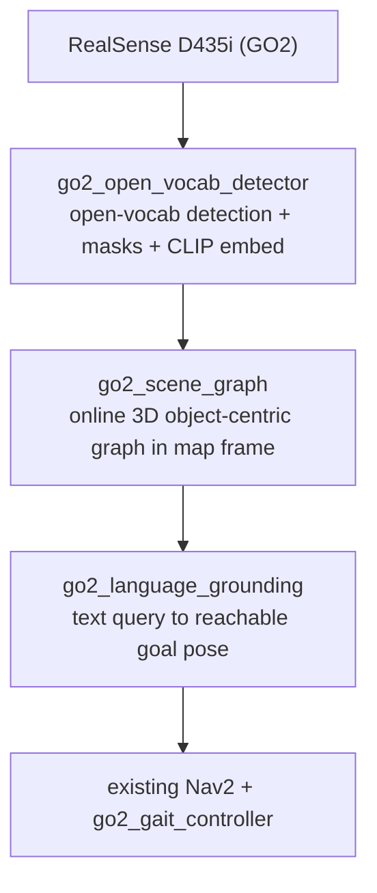
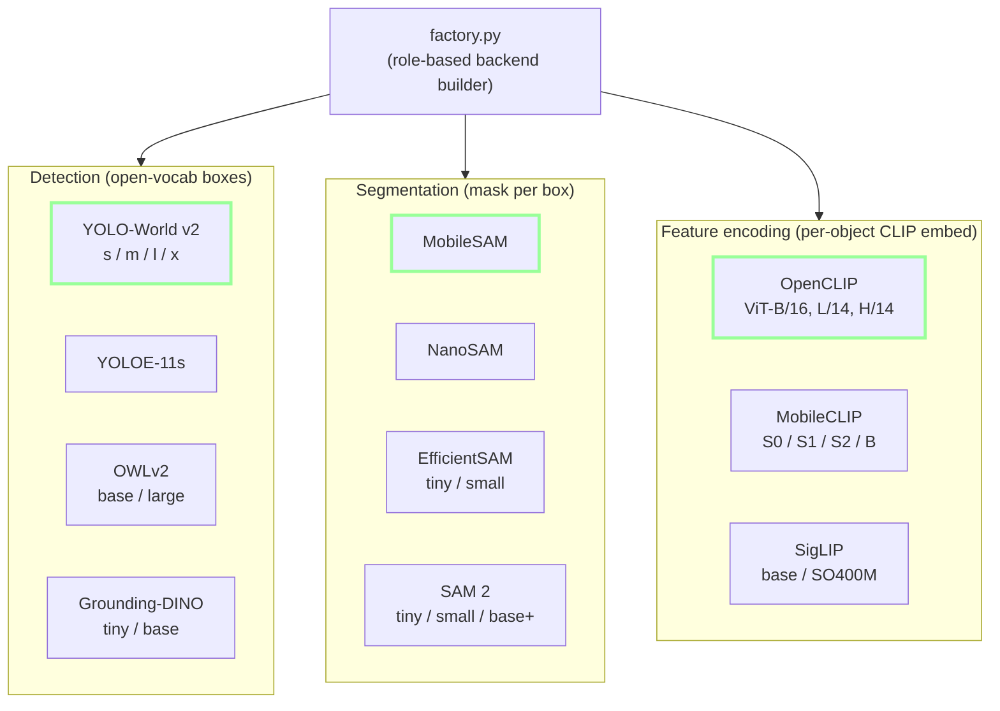
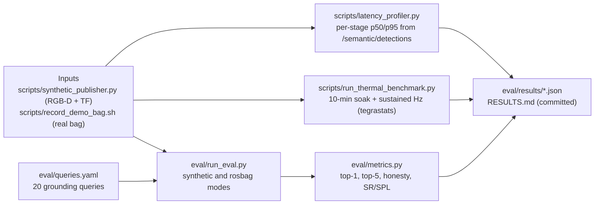

# go2-semantic-nav

[](LICENSE)
[](https://docs.ros.org/en/humble/)
[](https://www.nvidia.com/en-us/autonomous-machines/embedded-systems/jetson-orin/)

**Open-vocabulary 3D semantic scene-graph mapping and language-grounded navigation for the Unitree GO2 quadruped on NVIDIA Jetson Orin NX 16 GB.**

Speak or type a natural-language target, *"go stand next to the red chair"*, *"move near the window"*, *"approach the table beside the couch"*, and the robot builds an open-vocabulary 3D scene graph online, grounds the query against it, computes a reachable goal pose, and hands off to the existing Nav2 stack for execution.

This repository is a modular **overlay** on top of the [`GO2-seeing-eye-dog`](https://github.com/yusufdxb/GO2-seeing-eye-dog) autonomy stack. It does not replace any existing nodes; it subscribes to the RealSense camera topics, publishes `/goal_pose` in the `map` frame, and leaves Nav2, the gait controller, and the safety monitor untouched.

---

## Why this project

Closed-vocabulary perception (YOLO on fixed classes) cannot resolve "the *red* chair" or "the window". Recent embodied-nav research, ConceptGraphs (ICRA'24), OK-Robot (RSS'24), VLMaps (ICRA'23), HOV-SG (ICCV'23), CLIO, has converged on **object-centric 3D semantic scene graphs with CLIP embeddings** as the deployable substitute for dense neural fields and 3D Gaussian Splatting. This repo packages that pattern as a clean ROS 2 plugin for a real quadruped.

### Why not 3D Gaussian Splatting?
Live 3DGS optimization with densification does not hit near-real-time on Jetson Orin NX 16 GB at the 25 W thermal cap. GS is a *rendering* representation; the semantic payload still comes from a separate VLM. Swapping to an object-centric graph preserves the external story ("real-time 3D semantic mapping + language-guided quadruped nav on edge hardware") while dramatically raising the odds of a finished, demoable system. See [`docs/architecture.md`](docs/architecture.md) for the full rationale.

---

## System at a glance

- **Target hardware:** NVIDIA Jetson Orin NX 16 GB on Unitree GO2, plus RTX 5070 dev workstation (`mewtwo`).
- **Target latency budget:** sensor to `/goal_pose` under 100 ms on Jetson at 25 W (dev-workstation pipeline runs at 68 ms total on RTX 5070; Jetson on-robot eval pending).
- **Phase:** Phase 1, scaffold complete, dev-workstation eval landed, robot eval pending.
- **Eval state:** dev numbers in [`RESULTS.md`](RESULTS.md); on-robot eval not yet run.



Five ROS 2 packages (four Python, one CMake/IDL):

| Package | Role |
|---|---|
| `go2_semantic_msgs` | Custom messages, service, and action |
| `go2_open_vocab_detector` | Open-vocab detection + segmentation + CLIP embedding, publishes per-frame `SemanticDetectionArray` |
| `go2_scene_graph` | Online 3D object-centric scene graph in `map` frame with spatial relations |
| `go2_language_grounding` | Text query, chosen object, reachable `PoseStamped` on `/goal_pose`; exposes an action server |
| `go2_semantic_bringup` | Launch orchestration, RViz preset, composite configs |

Source tree under `ros2_ws/src/` matches this table 1:1.

### What each package actually does

- **RealSense D435i (GO2) inputs:**
  - `/camera/color/image_raw`
  - `/camera/depth/image_rect_raw`
  - `/camera/color/camera_info`
- **`go2_open_vocab_detector` (rclpy lifecycle):**
  - YOLO-World v2 / YOLOE for open-vocab boxes
  - MobileSAM / NanoSAM for mask per box
  - OpenCLIP / MobileCLIP for per-object embed
  - depth back-projection for 3D centroid
  - publishes `/semantic/detections`
- **`go2_scene_graph` (rclpy lifecycle):**
  - TF from `camera_color_optical_frame` to `map`
  - data-association and merge across frames
  - publishes `/semantic/scene_graph`
  - publishes `/semantic/object_markers` (RViz)
  - serves `/semantic/query_objects`
- **`go2_language_grounding` (rclpy lifecycle):**
  - query parser plus CLIP text encode
  - spatial relation resolver
  - costmap-aware stand-off goal sampling
  - action `/semantic/ground_and_navigate`
  - publishes `/goal_pose` to Nav2
- **existing Nav2 + `go2_gait_controller`:** unchanged, lives in the [`GO2-seeing-eye-dog`](https://github.com/yusufdxb/GO2-seeing-eye-dog) overlay.

---

## Detector backend taxonomy

Every backend below is implemented in `ros2_ws/src/go2_open_vocab_detector/go2_open_vocab_detector/backends/` and wired through `factory.py`. Profile YAMLs live in `config/scene_profiles/` and pick one backend per role.



Bold-outlined backends are the **default dev profile** (YOLO-World v2-s + MobileSAM + OpenCLIP ViT-B/16, measured at 68 ms total on `mewtwo-5070`). The planned **Jetson Tier-A** profile swaps to NanoSAM + MobileCLIP-S2; numbers pending the on-robot run. See [`docs/system_diagram.md`](docs/system_diagram.md) for the full backend plug points view and [`RESULTS.md`](RESULTS.md) for measured latencies.

---

## Evaluation pipeline

Eval is offline-first: record a real or synthetic rosbag, replay it through the live ROS 2 graph, capture per-stage timings and grounding outcomes, then aggregate. All of the boxes below are real scripts in this repo.



The latency profiler reads timestamps stamped into `SemanticDetectionArray.latency_*_ms` by the detector node, so reported numbers are measured inside the callback, not estimated from topic Hz. Current dev-platform numbers are in [`RESULTS.md`](RESULTS.md); Jetson 25 W rows are placeholders until the on-robot run.

---

## Prerequisites

- **ROS 2 Humble** with `nav2_bringup`
- **Python 3.10** (matches JetPack 6.x)
- **PyTorch 2.x with CUDA 12.x** (tested with `torch==2.11.0+cu128` on RTX 5070)
- **RealSense camera** publishing on `/camera/...` (same namespace as `go2_perception`)
- **TF tree** with `map -> odom -> base_link -> camera_color_optical_frame`
- **For deployment:** a running `GO2-seeing-eye-dog` overlay so Nav2 is up

Install Python ML deps into the colcon workspace venv:

```bash
pip install -r requirements.txt
```

## Build

```bash
cd ros2_ws
colcon build --symlink-install
source install/setup.bash
```

## Run (dev, with a recorded rosbag)

```bash
# Terminal 1: play the recorded RGB-D bag
ros2 bag play ~/data/go2-indoor-sample/

# Terminal 2: launch semantic-nav stack (detector + scene graph + grounding)
ros2 launch go2_semantic_bringup semantic_nav.launch.py \
    device:=cuda:0 \
    prompt_classes_file:=$(ros2 pkg prefix go2_open_vocab_detector)/share/go2_open_vocab_detector/config/prompts_indoor.yaml

# Terminal 3: ground a query
ros2 action send_goal /semantic/ground_and_navigate \
    go2_semantic_msgs/action/GroundAndNavigate \
    "{text_query: 'go near the red chair', stand_off_m: 0.9, dry_run: true}" \
    --feedback
```

`dry_run: true` computes and returns the goal pose without publishing to Nav2. Drop it to trigger navigation.

## Documentation

| Doc | What it covers |
|---|---|
| [`docs/architecture.md`](docs/architecture.md) | Component design, data flow, interface contracts, known constraints |
| [`docs/system_diagram.md`](docs/system_diagram.md) | Full ROS graph, backend plug points, goal-generation flow, topic + QoS contract |
| [`docs/deployment.md`](docs/deployment.md) | Jetson install, TensorRT export, launch on the robot |
| [`docs/demo.md`](docs/demo.md) | Operator procedure for a live demo run |
| [`docs/experiments.md`](docs/experiments.md) | Eval suite, metrics, how to reproduce reported numbers |
| [`docs/jetson_cookbook.md`](docs/jetson_cookbook.md) | Jetson-specific install and runtime notes |
| [`docs/latency_instrumentation.md`](docs/latency_instrumentation.md) | How per-stage timings are captured and aggregated |
| [`docs/troubleshooting.md`](docs/troubleshooting.md) | Common failure modes and fixes |
| [`RESULTS.md`](RESULTS.md) | Measured numbers per platform (dev + Jetson when available) |
| [`CHANGELOG.md`](CHANGELOG.md) | Per-release changes and discovered failure modes |
| [`AGENTS.md`](AGENTS.md) | Rules for agents working in this repo |

## Project status

**Phase 1: scaffold complete, dev-workstation eval landed, robot eval pending.**

What is done:
- 5 ROS 2 packages build clean; lifecycle nodes wired end to end.
- 9 detector backends, 4 segmenters, 3 encoder families pluggable through `factory.py` (see [`CHANGELOG.md`](CHANGELOG.md)).
- Two-layer grounding rejection (absolute floor + label/clip floor) replaces the v1 single-threshold gate after the synthetic-scene false-positive failure mode (documented in [`RESULTS.md`](RESULTS.md)).
- Latency profiler + thermal benchmark + rosbag-backed eval harness in place.
- TRT export scripts for YOLO-World, OpenCLIP image encoder, MobileSAM (encoder + decoder).
- CI: ruff lint + msgs build + pure-Python unit smoke.

What is **not** done:
- Robot-side eval on Jetson Orin NX (25 W and 15 W rows in [`RESULTS.md`](RESULTS.md) are still `<...>` placeholders).
- Real indoor rosbag suite. Current grounding numbers are on a synthetic single-image scene (`bus.jpg`), useful only as a sanity / honesty signal.
- Navigation success rate (SR) and SPL: harness exists, numbers not yet captured.
- Margin-based grounding gate. Deferred to Phase 5 post-rosbag eval; the current two-layer gate still lets one out-of-vocab query slip through (see [`RESULTS.md`](RESULTS.md) "Discovered" entry).

See [`NEXT_STEPS.md`](NEXT_STEPS.md) for the ordered Phase 1, 5 checklist with time estimates.

## Known limitations

- **No on-robot numbers yet.** Every Jetson row in [`RESULTS.md`](RESULTS.md) is a placeholder. The dev-workstation 68 ms / 14.7 Hz upper bound on RTX 5070 will **not** transfer 1:1 to Orin NX at 25 W; expect significantly lower sustained throughput.
- **Ultralytics YOLO-World** auto-installs OpenAI's `clip` package on first inference and can hang for minutes. Pre-install manually in production deploys ([`docs/troubleshooting.md`](docs/troubleshooting.md)).
- **Torch wheel pinning** is fragile on Blackwell GPUs: any `pip install --force-reinstall` without `--extra-index-url https://download.pytorch.org/whl/cu128` will replace the cu128 wheel with the default CUDA-13 one and break the detector.
- **Closed-vocab fallback (YOLO baseline)** is intentionally not implemented; the comparison story is against ConceptGraphs / VLMaps style baselines, not detection-only.

## License

MIT. See [LICENSE](LICENSE). Bundled model weights are licensed separately: Apache-2.0 for OpenCLIP and SAM variants; AGPL-3.0 for Ultralytics wrappers; `apple-amlr` for MobileCLIP (research use OK, check before any commercial deployment).
