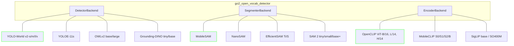
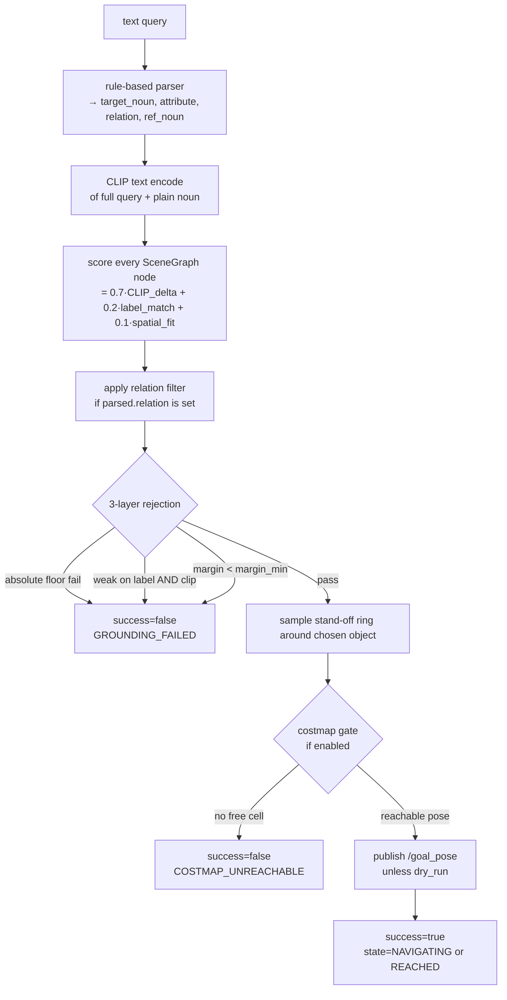

# System diagram

## Full data flow (as of 2026-04-13)

```mermaid
flowchart LR
  subgraph hw["GO2 + Jetson Orin NX"]
    RS[RealSense D435i]
    JET[Jetson]
  end

  subgraph edd["GO2-seeing-eye-dog (sibling; we overlay it)"]
    RSDRV[realsense2_camera driver]
    AMCL[AMCL / TF]
    NAV2[Nav2 stack]
    GAIT[go2_gait_controller]
  end

  subgraph ovr["go2-semantic-nav overlay (this repo)"]
    DET[go2_open_vocab_detector<br/>YOLO-World / MobileSAM / OpenCLIP]
    SG[go2_scene_graph<br/>object-centric graph in map frame]
    GR[go2_language_grounding<br/>parser + CLIP + goal sampler]
  end

  subgraph user["Operator"]
    CLI[ros2 action send_goal<br/>or scripts/send_query.py]
  end

  RS --> RSDRV
  RSDRV -- "/camera/color/image_raw<br/>/camera/depth/image_rect_raw<br/>/camera/color/camera_info" --> DET
  RSDRV -- depth cloud --> NAV2

  AMCL -- "/tf map→odom→base_link→camera_color_optical_frame" --> DET
  AMCL -. TF .-> SG
  AMCL -. TF .-> NAV2

  DET -- "/semantic/detections<br/>(SemanticDetectionArray)" --> SG
  SG -- "/semantic/scene_graph<br/>(SceneGraph)" --> GR
  SG -- "/semantic/object_markers<br/>(MarkerArray)" -.-> RVIZ[RViz]

  CLI -- "GroundAndNavigate.action" --> GR
  GR -- "/goal_pose<br/>(PoseStamped map)" --> NAV2
  GR -- "/semantic/grounding_viz" -.-> RVIZ

  NAV2 -- "/cmd_vel" --> GAIT
  GAIT -- "joint_trajectory" --> JET

  classDef over fill:#253,color:#fff,stroke:#9f9
  class DET,SG,GR over
```

## Backend plug points


Bold-outlined backends are wired into the default profile (`config/scene_profiles/dev_gpu.yaml`). Jetson Tier A swaps to `NS` + `MC-S2`.

## Goal-generation flow (inside grounding node)



## Topic + QoS contract (current live)

| Direction | Topic | Type | Reliability | Depth | Source |
|---|---|---|---|---|---|
| consume | `/camera/color/image_raw` | `sensor_msgs/Image` | BEST_EFFORT | 1 | RealSense driver |
| consume | `/camera/depth/image_rect_raw` | `sensor_msgs/Image` | BEST_EFFORT | 1 | RealSense driver |
| consume | `/camera/color/camera_info` | `sensor_msgs/CameraInfo` | RELIABLE | 10 | RealSense driver |
| consume | `/tf`, `/tf_static` | `tf2_msgs/TFMessage` | default | default | AMCL / robot state |
| consume | `/global_costmap/costmap` | `nav_msgs/OccupancyGrid` | RELIABLE | 1 | Nav2 |
| produce | `/semantic/detections` | `go2_semantic_msgs/SemanticDetectionArray` | RELIABLE | 5 | detector |
| produce | `/semantic/scene_graph` | `go2_semantic_msgs/SceneGraph` | RELIABLE | 5 | scene_graph |
| produce | `/semantic/object_markers` | `visualization_msgs/MarkerArray` | RELIABLE | 5 | scene_graph |
| produce | `/semantic/grounding_viz` | `visualization_msgs/MarkerArray` | RELIABLE | 10 | grounding |
| produce | `/goal_pose` | `geometry_msgs/PoseStamped` | RELIABLE | 10 | grounding |
| service | `/semantic/query_objects` | `go2_semantic_msgs/QueryObjects` |, |, | scene_graph |
| action | `/semantic/ground_and_navigate` | `go2_semantic_msgs/GroundAndNavigate` |, |, | grounding |
